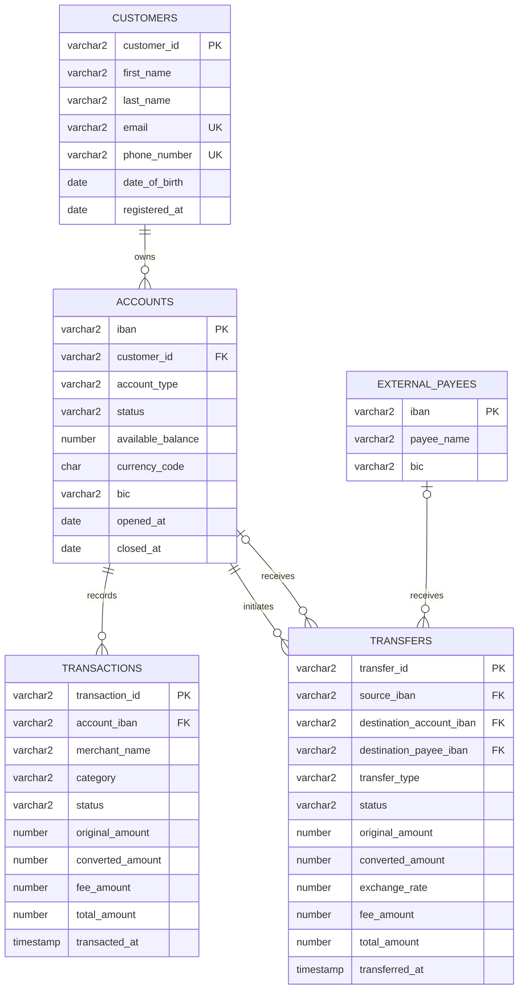

# Oracle Online Banking Database

[](https://github.com/RipplyPear/oracle-online-banking-database/actions/workflows/ci.yml)

An Oracle database project that models the core data and operations of a small online banking platform. It combines a constrained relational model, synthetic banking data, transactional PL/SQL services, reporting views, analytical SQL, automated tests, and a reproducible Docker Compose environment.

The project began as university coursework for Database and Oracle DBMS classes and was redesigned as a self-contained portfolio project. It no longer depends on a university-hosted database or proprietary desktop tooling.

## Highlights

- Reproducible Oracle AI Database Free environment with Docker Compose
- Five-table relational model with explicit integrity constraints
- Synthetic customers, accounts, payees, transfers, and card transactions
- Atomic internal and external transfers implemented in PL/SQL
- Deterministic row locking to reduce deadlock risk
- Savepoint-based rollback when a transfer fails
- Multi-currency amounts, exchange rates, and fees
- Reporting views and analytical queries using Oracle window functions
- Automated service tests that restore data with rollback
- GitHub Actions workflow that rebuilds and verifies the project from scratch

## Data model



An internal transfer references a destination account. An external transfer references an external payee. A check constraint guarantees that exactly one valid destination type is present.

## Technology

- Oracle AI Database Free 26ai
- PL/SQL and Oracle SQL
- Docker Engine and Docker Compose
- SQL\*Plus for automated execution
- Bash test runners
- GitHub Actions

The development image is pinned to `gvenzl/oracle-free:23.26.2-slim-faststart` for reproducibility.

## Getting started

### Prerequisites

- Docker Engine
- Docker Compose v2 or later
- Git

VS Code with the official Oracle SQL Developer extension is recommended for interactive database exploration, but it is not required to build or test the project.

### 1. Configure local credentials

```bash
cp .env.example .env
```

Edit `.env` and replace both placeholder passwords:

```dotenv
ORACLE_PASSWORD=your-local-admin-password
APP_USER_PASSWORD=your-local-app-password
```

The `.env` file is ignored by Git.

### 2. Start the database

```bash
docker compose up -d
docker compose logs -f oracle
```

The first startup is complete when the log contains:

```text
DATABASE IS READY TO USE!
```

### 3. Connect to Oracle

| Setting | Value |
|---|---|
| Host | `localhost` |
| Port | `1521` |
| Service name | `FREEPDB1` |
| Username | `BANKING_APP` |
| Password | `APP_USER_PASSWORD` from `.env` |

### 4. Run the tests

```bash
./scripts/run_tests.sh
```

The tests exercise account management and transfer operations, verify expected failures, and roll back all transactional data changes.

### 5. Run the analytical queries

```bash
./scripts/run_queries.sh
```

This runs ten documented examples covering joins, aggregation, conditional expressions, set operators, common table expressions, and window functions.

### Reset the database

Initialization scripts run only when the database volume is created. To rebuild everything from scratch:

```bash
docker compose down -v
docker compose up -d
```

> `docker compose down -v` permanently deletes the local Oracle volume.

## PL/SQL services

### `ACCOUNT_SERVICE`

- validates and normalizes IBAN values;
- reads available balances;
- counts a customer's accounts;
- opens accounts for existing customers;
- closes zero-balance accounts;
- adds external payees with BIC validation.

### `TRANSFER_SERVICE`

- executes same-currency and cross-currency internal transfers;
- executes transfers to external payees;
- locks internal-transfer accounts in lexical IBAN order;
- validates account status, exchange rates, fees, and funds;
- debits the source and credits the destination atomically;
- creates a transfer record only after all validations pass;
- rolls back partial changes when an operation fails;
- provides customer transfer counts and monthly reporting functions.

The monetary fields follow these rules:

```text
converted_amount = ROUND(original_amount * exchange_rate, 2)
total_amount     = original_amount + fee_amount
```

`total_amount` is the amount debited from the source account. `converted_amount` is the amount credited in the target currency.

## Reporting layer

| View | Purpose |
|---|---|
| `V_CUSTOMER_BALANCE_SUMMARY` | Customer balances grouped by currency without mixing monetary units |
| `V_TRANSFER_DETAILS` | Transfer history enriched with customer and payee names |
| `V_MONTHLY_CUSTOMER_OUTFLOW` | Completed monthly transfers, fees, and debited amounts |
| `V_ACCOUNT_ACTIVITY` | Unified outgoing and incoming account activity |

The query catalog demonstrates:

- `DENSE_RANK` for balance ranking within each currency;
- `LAG` for month-over-month comparisons;
- `RATIO_TO_REPORT` for category shares;
- running totals with window frames;
- `NOT EXISTS`, `UNION ALL`, `INTERSECT`, and `MINUS`;
- conditional aggregation by transfer status and type.

## Repository structure

```text
.
├── .github/workflows/ci.yml
├── compose.yaml
├── docs/
│   └── design-decisions.md
├── scripts/
│   ├── run_queries.sh
│   └── run_tests.sh
└── sql/
    ├── init/
    │   ├── 01_schema.sql
    │   ├── 02_seed_data.sql
    │   ├── 03_account_service.sql
    │   ├── 04_transfer_service.sql
    │   ├── 05_reporting_views.sql
    │   └── 90-93 verification scripts
    ├── queries/
    │   └── portfolio_queries.sql
    └── tests/
        └── test_services.sql
```

The initialization scripts use numeric prefixes because the container executes them alphabetically. Verification scripts deliberately run after all schema objects and seed data have been created.

## Testing strategy

Three levels of checks run against a clean database:

1. Initialization verification checks table, sequence, constraint, package, view, and seed-data integrity.
2. Service tests execute successful and unsuccessful business operations inside a savepoint.
3. The analytical query catalog is executed with `WHENEVER SQLERROR EXIT`, so any SQL failure produces a non-zero process status.

The GitHub Actions workflow repeats the same build and test process on an Ubuntu runner.

## Notes

- All records are synthetic and intended only for demonstration.
- IBAN validation is deliberately simplified to structural validation; production software should implement the ISO 13616 checksum.
- Exchange rates are supplied to PL/SQL operations rather than retrieved from a live market-data service.
- The project models database behavior, not authentication, authorization, regulatory compliance, or a complete banking application.

## License

This project is licensed under the [MIT License](LICENSE).